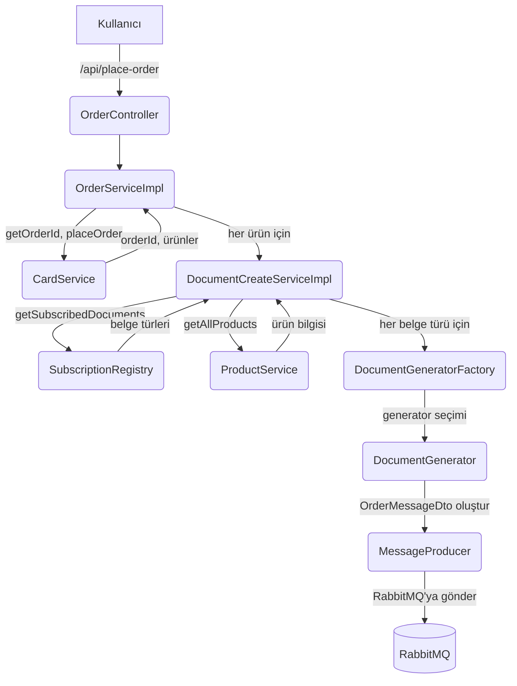

# Order Microservice - Detaylı Teknik Dokümantasyon

## Genel Bakış

Order Microservice, Spring Boot ile geliştirilmiş, siparişler için çeşitli belgeler (fatura, garanti belgesi, kargo etiketi, makbuz, gümrük beyannamesi) üreten ve bu belgeleri RabbitMQ üzerinden diğer servislere ileten bir mikroservistir. Ürün ve kart servisleriyle Feign Client üzerinden haberleşir, dinamik olarak ürün ve belge eşleşmelerini yönetir.

---

## Ana Bileşenler ve Sorumlulukları

### 1. Controller Katmanı

- **OrderController**
  - Endpoint: `POST /api/place-order`
  - Request Body: `PlaceOrderRequest` (userName alanı içerir)
  - Görev: Sipariş oluşturma isteğini alır ve iş akışını başlatır.

### 2. Service Katmanı

- **OrderService & OrderServiceImpl**
  - Yöntem: `placeOrder(String userName)`
  - CardService ile sipariş ID'si ve ürün listesi alınır.
  - Her ürün için belge üretim süreci başlatılır.

- **DocumentCreateService & DocumentCreateServiceImpl**
  - Yöntem: `createDocuments(String productName, Long orderId)`
  - Ürüne abone olunan belge türleri SubscriptionRegistry'den alınır.
  - Ürün detayları ProductService'den çekilir.
  - Her belge türü için uygun DocumentGenerator seçilir, içerik dinamik olarak oluşturulur ve mesaj kuyruğa gönderilir.

### 3. Registry Katmanı

- **SubscriptionRegistry**
  - Ürün ismine göre hangi belge türlerinin üretileceğini belirler.
  - Ürün ve belge eşleşmeleri ProductService'den dinamik olarak alınır, erişilemezse fallback olarak statik eşleşme kullanılır.

### 4. Generator Katmanı

- **DocumentGenerator (interface)**
  - Yöntemler: `generate(Long orderId)`, `supports()`
  - Her belge türü için bir implementasyonu vardır:
    - InvoiceGenerator (Fatura)
    - ShippingLabelGenerator (Kargo etiketi)
    - WarrantyCardGenerator (Garanti belgesi)
    - ReceiptGenerator (Makbuz)
    - CustomsDeclarationGenerator (Gümrük beyannamesi)
  - Her biri, ilgili belgeyi üretir ve MessageProducer ile RabbitMQ'ya gönderir.

- **DocumentGeneratorFactory**
  - Belge türüne göre uygun generator'ı seçer.

### 5. Messaging

- **MessageProducer**
  - RabbitMQ'ya mesaj göndermekten sorumlu.
  - Kuyruk, exchange ve routing key RabbitConfig'te tanımlı.

### 6. Feign Client'lar

- **CardService**
  - Sipariş ID'si ve ürün listesi almak için kullanılır.
- **ProductService**
  - Ürün detaylarını almak için kullanılır.

---

## Model Katmanı

- **OrderMessageDto**
  - Mesaj kuyruğuna gönderilen veri transfer nesnesi.
  - Alanlar: documentType, orderId, documentContent

- **PlaceOrderRequest**
  - Sipariş oluşturma isteği için kullanılan DTO.
  - Alanlar: userName

- **ProductEntity**
  - Ürün bilgilerini tutar: id, name, producer, price, documentTypes

- **DocumentType (enum)**
  - Desteklenen belge türleri ve varsayılan içerikleri.

---

## Yapılandırma

- **application.properties**
  - RabbitMQ, PostgreSQL ve Feign Client ayarları burada tutulur.
  - Örnek:
    ```
    spring.rabbitmq.host=localhost
    spring.rabbitmq.port=5672
    spring.rabbitmq.username=user
    spring.rabbitmq.password=pass

    spring.datasource.url=jdbc:postgresql://localhost:5432/postgres
    spring.datasource.username=root
    spring.datasource.password=root

    server.port=8082
    ```

- **RabbitConfig**
  - RabbitMQ queue, exchange ve routing key tanımları.

---

## Bağımlılıklar (pom.xml'den Özet)

- Spring Boot Starter Web, Data JPA, AMQP (RabbitMQ), OpenFeign, Lombok, PostgreSQL, Springdoc OpenAPI

---

## Detaylı İş Akışı

1. **Kullanıcı**, `/api/place-order` endpoint'ine `PlaceOrderRequest` ile istek atar.
2. **OrderController**, isteği alır ve `OrderServiceImpl.placeOrder(request.getUserName())` metodunu çağırır.
3. **OrderServiceImpl**:
   - CardService ile `getOrderId` ve `placeOrder` çağrıları yapar.
   - Kullanıcının sepetindeki ürünleri ve sipariş ID'sini alır.
   - Her ürün için `DocumentCreateServiceImpl.createDocuments(product, orderId)` çağrısı yapar.
4. **DocumentCreateServiceImpl**:
   - SubscriptionRegistry'den ürünün abone olduğu belge türlerini alır.
   - ProductService'den ürün detaylarını çeker.
   - Her belge türü için:
     - DocumentGeneratorFactory ile uygun generator'ı seçer.
     - Ürün bilgilerine göre belge içeriğini dinamik oluşturur.
     - Generator'ın `generate(orderId)` metodunu çağırır.
5. **DocumentGenerator** (ör. InvoiceGenerator):
   - OrderMessageDto nesnesi oluşturur.
   - MessageProducer ile RabbitMQ'ya mesaj gönderir.
6. **RabbitMQ**: Mesajı kuyruğa alır, diğer mikroservisler bu mesajı işleyebilir.

---

## İş Akış Diyagramı



---

## Genişletilebilirlik

- Yeni bir belge türü eklemek için:
  1. `DocumentType` enum'una yeni tür eklenir.
  2. Yeni bir generator sınıfı yazılır.
  3. DocumentGeneratorFactory'ye eklenir.

---

## Örnek Kullanım

```http
POST /api/place-order
Content-Type: application/json

{
  "userName": "ali"
}
```
Bu istek, kullanıcının sepetindeki ürünler için gerekli tüm belgeleri üretir ve mesaj kuyruğuna gönderir. 